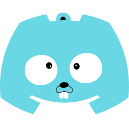

# Discog



Discog is a [Go](https://golang.org/) package and a discord bot library which uses [Discordgo](https://github.com/bwmarrin/discordgo) to interact with Discord API.

Discog provides a boilerplate less way to build discord bot. It has following features : 
* Command manager
* Interaction Manager
* Handlers

**For help with this package or general Go discussion, please join the [Discog Discord Server](https://discord.gg/golang) chat server.**

## Getting Started

### Installing

Discog uses **Discordgo** so it's important to upto date with **Discordgo** version for **Discog** which is `v0.28.1` 

`go get` *will always pull the latest tagged release from the master branch.*

```sh
go get github.com/kisshan13/discog
```

### Usage

Import the package into your project.

```go
package main

import (
	"log"

	"github.com/bwmarrin/discordgo"
	discog "github.com/kisshan13/discog"
	commands "command"
)

func main() {

	manager := commands.GetManager()
	bot, err := discog.NewBot("<token-here>", manager)

	if err != nil {
		panic(err)
	}

	bot.OnReady(func(r *discordgo.Ready) {
		log.Printf("Bot has connected to Discord as %s (%s)\n", r.User.Username, r.User.ID)
	})

	bot.Run(func(session *discordgo.Session, err error) {
		if err != nil {
			panic(err)
		}
		log.Println("Bot is running")
	})
}

```

For more information & documentation please visit examples [repo](https://github.com/kisshan13/discog-examples) . 